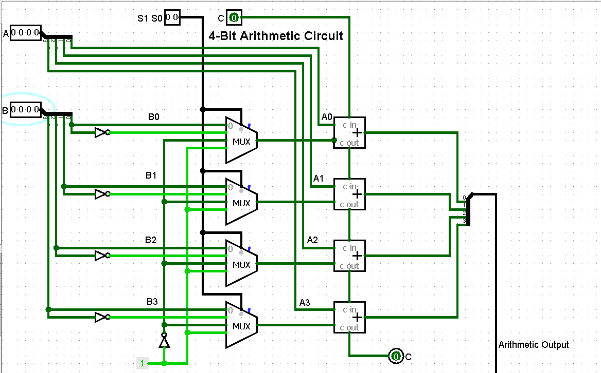
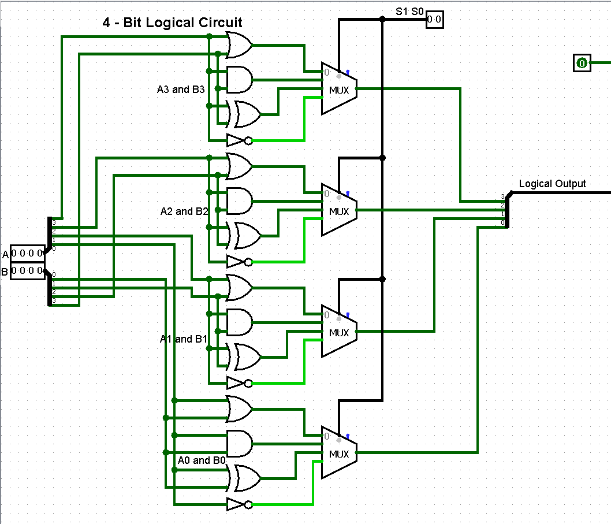

# 4-bit Arithmetic Logic Unit (ALU) – Logisim

This project implements a **4-bit Arithmetic Logic Unit (ALU)** designed using Logisim.

An ALU is a core component of a CPU that performs arithmetic and logical operations on binary numbers.

This circuit demonstrates how fundamental digital components can be combined to perform multiple operations on 4-bit inputs.

---

## Features

Arithmetic Operations
- Addition
- Addition with Carry
- Subtraction
- Subtraction with Borrow
- Transfer A
- Increment A
- Decrement A

Logical Operations
- AND
- OR
- XOR
- NOT

---

## Inputs

A[3:0] – First 4-bit operand  
B[3:0] – Second 4-bit operand  
Select Lines – Determine which operation is performed

---

## Outputs

Result[3:0] – Result of the selected operation  
Carry Out – Carry bit generated during arithmetic operations

---

## Operation Table for Arithmetic Unit

| S1 | S2 | C | Operation |
|----|----|----|---------------|
| 0 | 0 | 0 | Addition |
| 0 | 0 | 1 | Addition with Carry |
| 0 | 1 | 0 | Subtraction with Borrow |
| 0 | 1 | 1 | Subtraction |
| 1 | 0 | 0 | Transfer A |
| 1 | 0 | 1 | Increment A |
| 1 | 1 | 0 | Decrement A |
| 1 | 1 | 1 | Transfer A |

---

## Operation Table for Logical Unit

| S1 | S2 | Operation |
|----|----|---------------|
| 0 | 0 | AND |
| 0 | 1 | OR |
| 1 | 0 | XOR |
| 1 | 1 | NOT |

## Circuit Diagram

---

## Tools Used

- Logisim

---

## Applications

This project demonstrates the basic working principle of an **Arithmetic Logic Unit (ALU)**, which is used in:

- CPUs
- Microcontrollers
- Digital signal processors

---

## Author

Aanyaa Patel
